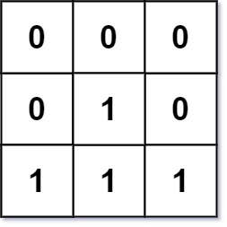

# 542. 01 Matrix (Medium)

### 题目描述

给定一个由0和1组成饿二维矩阵，求每个位置到最近的0的距离。

示例 1：

.png>)

输入：mat = \[\[0,0,0],\[0,1,0],\[0,0,0]] 输出：\[\[0,0,0],\[0,1,0],\[0,0,0]]&#x20;

示例 2：



输入：mat = \[\[0,0,0],\[0,1,0],\[1,1,1]] 输出：\[\[0,0,0],\[0,1,0],\[1,2,1]]

### 解题思路

最短距离问题，与上一题不同的是，上一题只用检查左和上两个位置，用按行遍历二维数组即可。

但本题需要遍历上下左右四个方向，若直接按行遍历，无法得知下和右两个方向的值。

既然如此，我们就先进行左上到右下的遍历，再进行右下到左上的遍历，经过两次遍历后，即完成了四个方向的检查。

除此之外，还需要知道上下左右哪个方向是最小值，我们取四者中的最小值。

技巧是

```
由于遍历很可能超边界
//先比较左边的值
if(j > 0){
    dp[i][j] = min(dp[i][j], dp[i][j-1] + 1);
}
//再比较上边的值
if( i > 0){
    dp[i][j] = min(dp[i][j], dp[i-1][j] + 1);
}
经过以上步骤，就可以得出三者中的最小值。
```

### 代码

```cpp
class Solution {
public:
    vector<vector<int>> updateMatrix(vector<vector<int>>& mat) {
        int m = mat.size();
        int n = mat[0].size();
        vector<vector<int>> dp(m, vector<int> (n,INT_MAX - 1));
        for(int i = 0; i < m; ++i){
            for(int j = 0; j < n; ++j){
                if(mat[i][j] == 0){
                    dp[i][j] = 0;
                }else{
                    if(j > 0){
                        dp[i][j] = min(dp[i][j], dp[i][j-1] + 1);
                    }
                    if( i > 0){
                        dp[i][j] = min(dp[i][j], dp[i-1][j] + 1);
                    }
                }
            }
        }

        for(int i = m - 1; i >=0; --i){
            for(int j = n - 1; j >=0; --j){
              if(mat[i][j] == 1)
              {
                    if(j < n - 1){
                        dp[i][j] = min(dp[i][j], dp[i][j+1] + 1);
                    }
                    if(i < m - 1){
                        dp[i][j] = min(dp[i][j], dp[i+1][j] + 1);
                    }
                }
            }
        }
        return dp;
    }
};
```

###  总结

&#x20;本题要点：

1. 遍历两次二维数组，左上到右下和右下到左上。
2. 如何处理数组边界问题
3. 如何获得上下左右四个方向的最小值。
